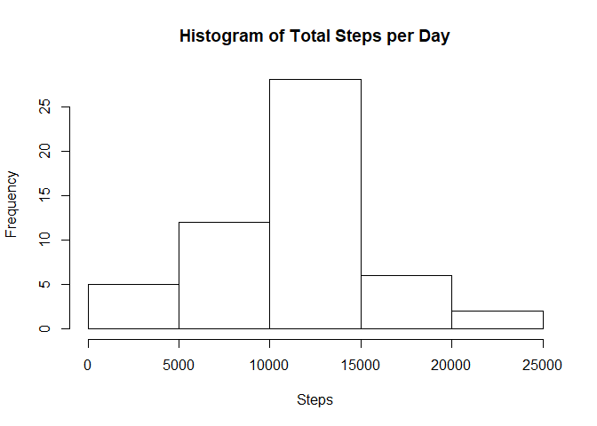
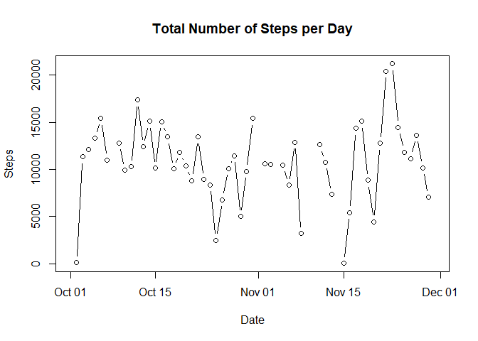
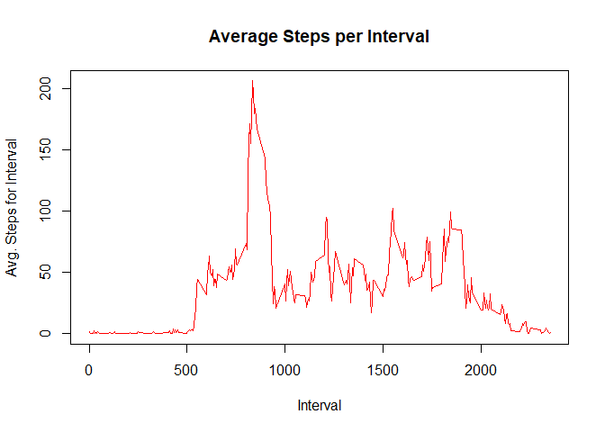
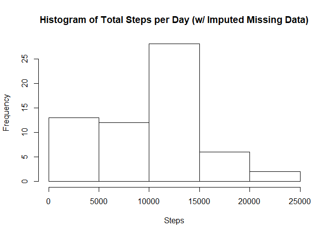
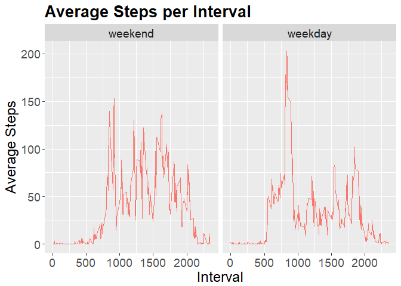

# Reproducible Research Project 1
Bill Seely  
June 27, 2017  
## Make sure needed libraries are referenced


```r
require(dplyr)
require(Hmisc)
require(ggplot2)
```

## Loading and Preprocessing the Data

Make the /data and /figure subdirectories if they doesn't exist.
Then pull in and unzip the data needed for the analysis,
converting the date field to an R date field


```r
if(dir.exists("./data")==FALSE) dir.create("./data",recursive = FALSE)
if(dir.exists("./figure")==FALSE) dir.create("./figure",recursive = FALSE)
download.file("https://d396qusza40orc.cloudfront.net/repdata%2Fdata%2Factivity.zip", destfile="./data/ActivityData.zip")
unzip("./data/ActivityData.zip",overwrite = TRUE, exdir="./data")
activityData_raw<-read.csv("./data/activity.csv", as.is=TRUE)
activityData_proc<-activityData_raw
activityData_proc$date<-as.Date(activityData_proc$date)
```

The names of the fields in the imported data:
steps, date, interval

The first 10 rows of the imported data:

```
##    steps       date interval
## 1     NA 2012-10-01        0
## 2     NA 2012-10-01        5
## 3     NA 2012-10-01       10
## 4     NA 2012-10-01       15
## 5     NA 2012-10-01       20
## 6     NA 2012-10-01       25
## 7     NA 2012-10-01       30
## 8     NA 2012-10-01       35
## 9     NA 2012-10-01       40
## 10    NA 2012-10-01       45
```

The last 10 rows of the imported data:

```
##       steps       date interval
## 17559    NA 2012-11-30     2310
## 17560    NA 2012-11-30     2315
## 17561    NA 2012-11-30     2320
## 17562    NA 2012-11-30     2325
## 17563    NA 2012-11-30     2330
## 17564    NA 2012-11-30     2335
## 17565    NA 2012-11-30     2340
## 17566    NA 2012-11-30     2345
## 17567    NA 2012-11-30     2350
## 17568    NA 2012-11-30     2355
```

The names of the fields in the imported data are:
steps, date, interval

## What is the mean for total number of steps taken each day?

Summing the steps by day:

```r
activityData_proc %>% group_by(date) %>% summarise("steps"=sum(steps))->dailySteps_tot
```

Plotting a histogram of daily step totals (before missing values imputation)

```r
hist(dailySteps_tot$steps, main="Histogram of Total Steps per Day", xlab = "Steps")
```

<!-- -->


The mean for number of steps per day is

```r
mean(dailySteps_tot$steps,na.rm = TRUE)
```

```
## [1] 10766.19
```
The median for number of steps per day is

```r
median(dailySteps_tot$steps,na.rm = TRUE)
```

```
## [1] 10765
```

Time series plot of daily step totals

```r
plot(dailySteps_tot$date, dailySteps_tot$steps, main="Total Number of Steps per Day", xlab="Date", ylab="Steps", type="b")
```

<!-- -->


## What is the daily activity pattern?

Calculate the average steps per interval over all days:


```r
activityData_proc %>% group_by(interval) %>% summarise("steps"=mean(steps, na.rm=TRUE))->dailySteps_intavg
```


Time series plot of average steps per interval over all days:


```r
plot(dailySteps_intavg$interval, dailySteps_intavg$steps, main="Average Steps per Interval", xlab="Interval", ylab="Avg. Steps for Interval", type="l", col="red")
```

<!-- -->


The highest average for steps is for this row:

```r
dailySteps_intavg[which(dailySteps_intavg$steps == max(dailySteps_intavg$steps, na.rm=TRUE)), ]
```

```
## # A tibble: 1 × 2
##   interval    steps
##      <int>    <dbl>
## 1      835 206.1698
```


## Imputing missing values

The count of missing values in the raw steps data is:

```r
sum(is.na(activityData_raw$steps))
```

```
## [1] 2304
```

Missing data are replaced using the impute() function from the Hmisc package.
This replaces missing data with the median value given for the other values in the row. Many of the missing values occur over night when there is low or nearly no data, and so the imputed values that replace them are mostly zeros. 


```r
activityData_proc$imputedSteps<-with(activityData_proc, impute(steps, median))
tail(activityData_proc,10)
```

```
##       steps       date interval imputedSteps
## 17559    NA 2012-11-30     2310            0
## 17560    NA 2012-11-30     2315            0
## 17561    NA 2012-11-30     2320            0
## 17562    NA 2012-11-30     2325            0
## 17563    NA 2012-11-30     2330            0
## 17564    NA 2012-11-30     2335            0
## 17565    NA 2012-11-30     2340            0
## 17566    NA 2012-11-30     2345            0
## 17567    NA 2012-11-30     2350            0
## 17568    NA 2012-11-30     2355            0
```

The count of missing values in the imputed steps data is:

```r
sum(is.na(activityData_proc$imputedSteps))
```

```
## [1] 0
```

Histogram of steps per day for imputed steps data:

```r
activityData_imp <-(activityData_proc[,c(2,3,4)])
activityData_imp$imputedSteps<-as.numeric((activityData_imp$imputedSteps))
activityData_imp %>% group_by(date) %>%
summarise("steps"=sum(imputedSteps))->dailySteps_imptot

hist(dailySteps_imptot$steps, main="Histogram of Total Steps per Day (w/ Imputed Missing Data)", xlab = "Steps")
```

<!-- -->


The mean for number of steps per day with imputed values is

```r
mean(dailySteps_imptot$steps,na.rm = TRUE)
```

```
## [1] 9354.23
```
The median for number of steps per day with imputed values is

```r
median(dailySteps_imptot$steps,na.rm = TRUE)
```

```
## [1] 10395
```


## Are there differences in activity patterns between weekdays and weekends?


```r
weekdays1 <- c('Monday', 'Tuesday', 'Wednesday', 'Thursday', 'Friday')
activityData_imp$wDay<- factor((weekdays(activityData_imp$date) %in% weekdays1),
                               levels=c(FALSE, TRUE), labels=c('weekend', 'weekday'))
```


```r
activityData_imp%>%group_by(interval, wDay)%>%
summarise("steps"=mean(imputedSteps))->activityData_avg

stepsByInterval <- ggplot(activityData_avg, aes(interval, steps, color="red")) +
geom_line(show.legend=FALSE) +
ggtitle("Average Steps per Interval") +
xlab("Interval") + ylab("Average Steps") +
theme(plot.title = element_text(lineheight=.8, face="bold",
size = 20)) +
theme(text = element_text(size=18))

stepsByInterval + facet_grid(. ~ wDay)
```

<!-- -->


